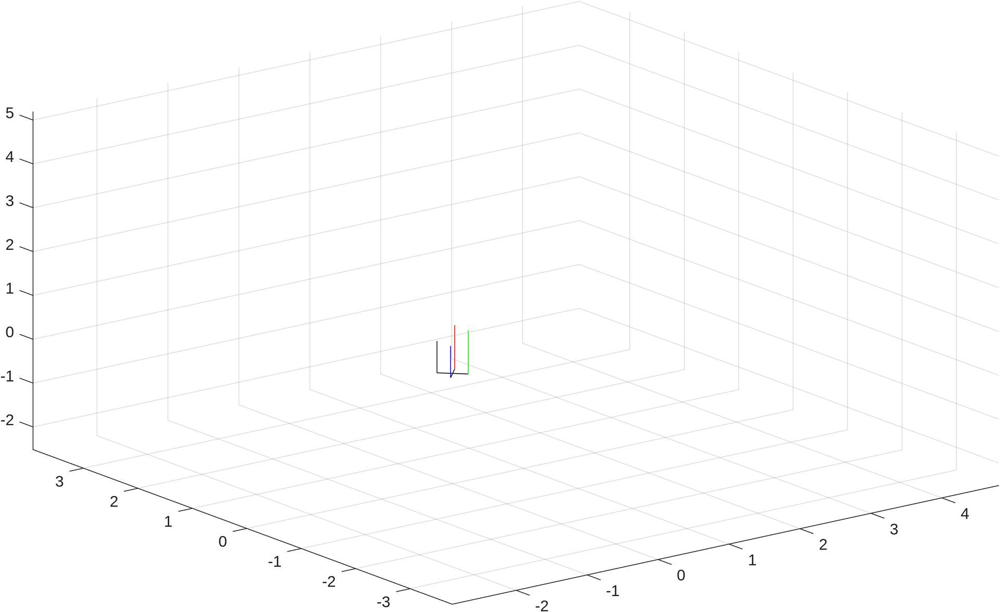
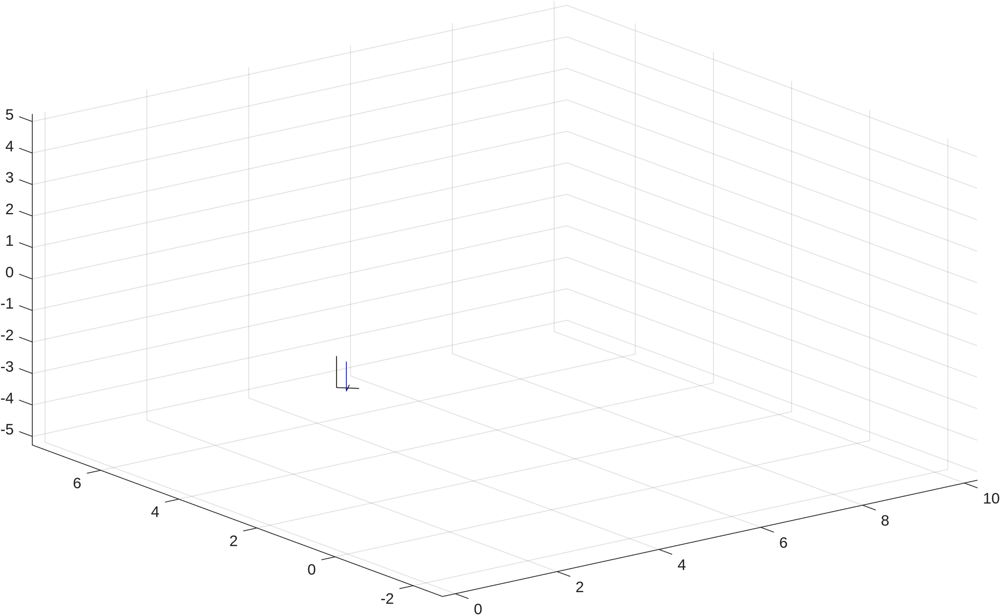

# Trajectory optimization of a quadrotor via direct transcription

This matlab codebase implements trajectory optimization for a quadrotor using direct transcription. The control space is four motor commands in the range $$[0, 1]$$. The system is modeled using rigid body dynamics with quadratic velocity and angular velocity drag, and torque produced from motor moments and propeller motion.

## Demos

